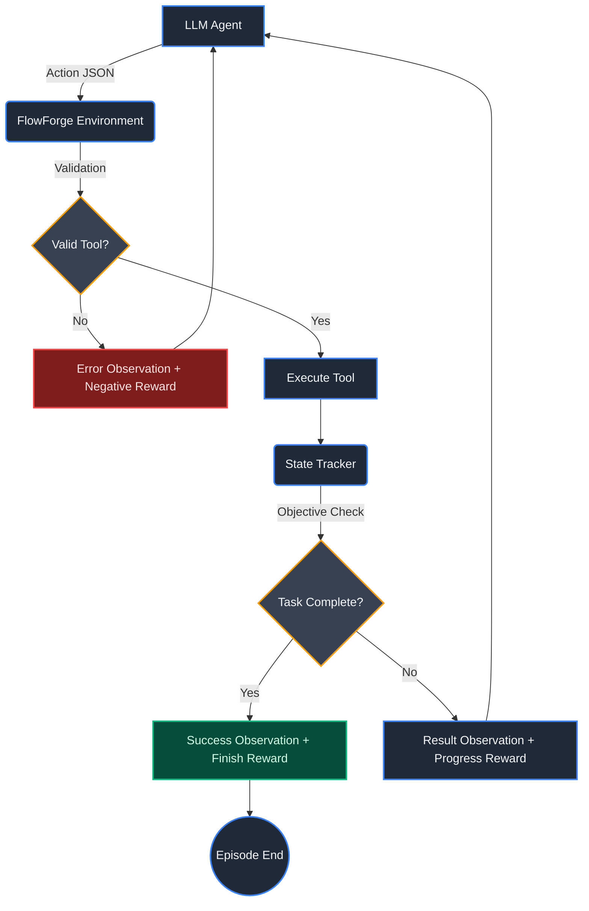

<div align="center">

# 🔧 FlowForge AI

**An OpenEnv-compatible Reinforcement Learning environment for Enterprise Workflow Automation.**

[](https://huggingface.co/spaces/open-env/validator)
[](https://huggingface.co/open-env)
[](https://www.python.org/)

FlowForge simulates actual back-office operations where LLM agents act as automated HR/operations assistants, learning to synthesize information, manage tools, and recover from real-world errors.

</div>

---

## ✨ Key Features

- **Genuine Enterprise Operations**: Move beyond toy environments. Agents read files, search employee databases, run SQL queries, schedule meetings, and send emails.
- **Strictly Defined Action Space**: Validated entirely via Pydantic — preventing hallucinatory tool calls.
- **Task-Aware Reward Shaping**: Dense reward signals that adapt based on the task (e.g., `read_file` is crucial for hard tasks, but optional for easy ones).
- **Anti-Loop Architecture**: Punishes infinite loops and duplicate actions to teach agents efficient planning.
- **Zero-Cost Baseline**: Run locally and test deterministically without eating up OpenAI credits.

---

## ⚙️ How it Works



---

## 🚀 Quickstart

### Local Setup

```bash
# Set up a virtual environment
python -m venv .venv
source .venv/bin/activate

# Install dependencies
pip install -r requirements.txt

# Run the deterministic baseline inference (tests all 3 tasks)
python inference.py
```

### Docker Deployment

```bash
# Build the image
docker build -t flowforge-ai .

# Run the container
docker run -p 7860:7860 --cpus=2 --memory=8g flowforge-ai
```

---

## 📊 Environment Specifications

<details>
<summary><strong>1. Action Space</strong></summary>

The Action Space is strictly defined via the Pydantic `FlowForgeAction` model. 

**Available Tools:**
| Tool | Parameters | Description |
|------|-----------|-------------|
| `search_db` | `query: str` | Search employee/service database |
| `send_email` | `to: str, subject: str, body: str` | Send simulated email |
| `read_file` | `file_path: str` | Read internal reports/files |
| `run_query` | `query: str` | Execute SQL SELECT on database |
| `schedule_meeting` | `attendees: list, date: str, title: str` | Schedule a calendar meeting |
| `finish` | _(none)_ | Signal task completion |
</details>

<details>
<summary><strong>2. Observation Space</strong></summary>

Defined via the `FlowForgeObservation` Pydantic model:
| Field | Type | Description |
|-------|------|-------------|
| `message` | `str` | Free-text feedback from the environment |
| `data` | `dict` | Structured result data (query rows, file contents, etc.) |
| `error` | `bool` | True if the previous action failed |
| `available_tools` | `list[str]` | Tools available in the current episode |
| `state_summary` | `dict` | Step count, progress, action history, usage stats |
</details>

<details>
<summary><strong>3. Reward Function (Dense)</strong></summary>

| Signal | Value | Condition |
|--------|-------|-----------|
| Tool execution bonus | `+0.2 × relevance` | Successful tool call (scaled by task relevance) |
| Objective progress bonus | `+0.3 × (1 + ratio)` | First time a new objective is satisfied |
| Sub-goal proximity | `+0.1` | Intermediate progress without hitting objective |
| Finish reward | `+0.1` | Clean termination via `finish` |
| Tool failure penalty | `-0.1` | Invalid parameters or execution error |
| Unknown tool penalty | `-0.2` | Attempting a tool that doesn't exist |
| Loop penalty | `-0.05 × frequency` | Repeating the same tool (capped at -0.2) |
</details>

---

## 📈 Base Performance

Evaluated using the rule-based baseline agent `inference.py` (guarantees perfect task compliance without LLM hallucination).

| Task Difficulty | Objectives | Baseline Score (0-1.0) |
|-----------------|------------|-----------------------|
| **Easy** | Find employee data | **1.00** 🏆 |
| **Medium** | DB search + Send email | **1.00** 🏆 |
| **Hard** | Read report + SQL Query + Schedule + Email | **1.00** 🏆 |

---

## 📁 Repository Structure

```text
FlowForge/
├── inference.py              # Main inference entry point
├── openenv.yaml              # Environment configuration definitions
├── Dockerfile                # Production container specification
├── requirements.txt          # Python dependencies
├── deploy_to_hf.py           # Deployment automation script
├── flowforge/                # Core Environment Logic
│   ├── env.py                # FlowForgeEnvironment implementation
│   ├── grader.py             # Objective-based scoring methodology
│   ├── models.py             # Pydantic Action/Observation schemas
│   ├── tasks/                # Difficulty presets
│   │   ├── task_easy.py
│   │   ├── task_medium.py
│   │   └── task_hard.py
│   └── tools/                # Mock Enterprise Tools
│       ├── search_db.py
│       ├── send_email.py
│       ├── read_file.py
│       ├── run_query.py
│       └── schedule_meeting.py
└── server/                   # HTTP Wrapper (OpenEnv spec)
    └── app.py                # FastAPI endpoints
```
