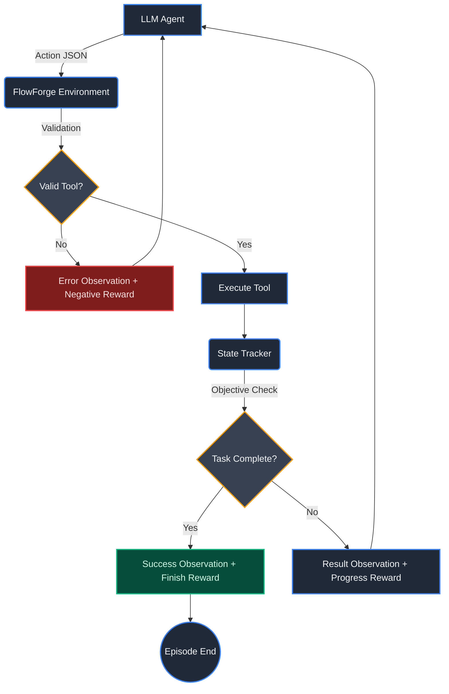

<div align="center">

# FlowForge AI

**An OpenEnv-compatible Reinforcement Learning environment for Enterprise Workflow Automation.**

[](https://huggingface.co/spaces/open-env/validator)
[](https://www.python.org/)
[](LICENSE)

FlowForge simulates actual back-office operations where LLM agents act as automated HR/operations assistants, learning to synthesize information, manage tools, and recover from real-world errors.

</div>

---

## Key Features
- **Genuine Enterprise Operations**: Move beyond toy environments. Agents read files, search employee databases, run SQL queries, schedule meetings, and send emails.
- **Strictly Defined Action Space**: Validated entirely via Pydantic -- preventing hallucinatory tool calls.
- **Task-Aware Reward Shaping**: Dense reward signals that adapt based on the task (e.g., `read_file` is crucial for hard tasks, but optional for easy ones).
- **Anti-Loop Architecture**: Punishes infinite loops and duplicate actions to teach agents efficient planning.
- **Zero-Cost Baseline**: Run locally and test deterministically without eating up OpenAI credits.

---

## How it Works


---

## Getting Started

### Local Setup
```bash
# Set up a virtual environment
python -m venv .venv
source .venv/bin/activate

# Install dependencies
pip install -r requirements.txt

# Run the deterministic baseline inference (tests all 3 tasks)
python inference.py
```

### Docker Deployment
```bash
# Build the image
docker build -t flowforge-ai .

# Run the container
docker run -p 7860:7860 --cpus=2 --memory=8g flowforge-ai
```

---

## Tech Stack

- **Language**: Python 3.11+
- **RL Framework**: OpenEnv-compatible Gymnasium interface
- **Validation**: Pydantic v2 for strict action schema enforcement
- **Containerization**: Docker with multi-stage builds
- **LLM Integration**: Supports any OpenAI-compatible API endpoint

---

## License

Distributed under the MIT License. See `LICENSE` for details.
